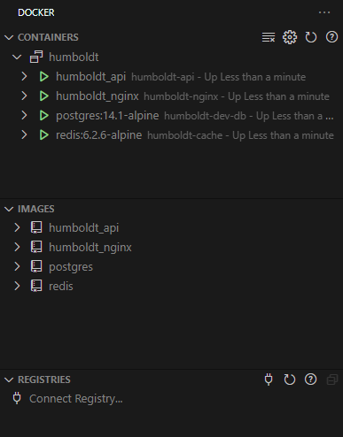

# Humboldt

## Clone

    git clone https://github.com/Devkeystuff/humboldt.git

## Installation

### [Git LFS](https://git-lfs.github.com/)

> "Replaces large files such as audio samples, videos, datasets, and graphics with text pointers inside Git"

\- Official Docs

### [NPM]

### [Conda](https://www.anaconda.com/products/individual)

For managing python environments

Gets created automatically using `just setup` (More on just in [Commands]("#commands") section)

### [Cargo](https://www.rust-lang.org/)

For managing packages, in our case...

#### [Just](https://github.com/casey/just)

For running automated scripts that make the development process easier

    cargo install just

### [Docker](https://www.docker.com/get-started)

#### And [docker-compose](https://docs.docker.com/compose/install/) if running on linux

Project is containerized. For more details look into `docker-compose.yml` in the root directory

> IMPORTANT NOTICE: For windows you must have a [WSL2]("https://docs.microsoft.com/en-us/windows/wsl/install") set up!

## Commands

### Just

Sets up the development environment

    just setup

Starts the applications

    just dev

_It should look something like this_

Stops the applications

> _You will need to do Ctrl+C to stop the frontend app first_

    just stop

Format files

    just format

Commit staged files

    just commit

### Docker

Build containers

    docker-compose build

If you want to just run the apps without `just dev` for some reason

    docker-compose up

**OR**

To run in detached mode

    docker-compose up -d

And to bring the apps down use

    docker-compose down

## Commits

For commit formating we're using [conventional commits](https://www.conventionalcommits.org/en/v1.0.0/) provided by [commitizen](https://commitizen.github.io/cz-cli/)

You can do `git commit` instead but you must use the conventional commit format anyway