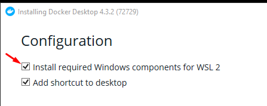
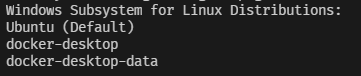
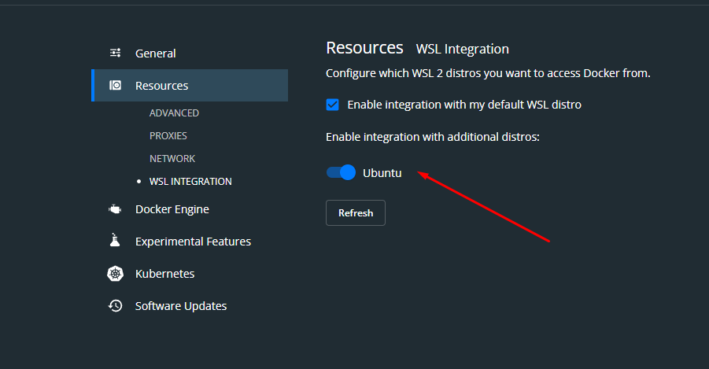
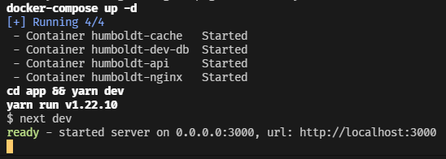

# Humboldt

## Clone

    git clone https://github.com/Devkeystuff/humboldt.git

## Installation on WSL

### Set up WSL

1.  Get [WSL 2](https://docs.microsoft.com/en-us/windows/wsl/install)
2.  Initialize Ubuntu distro using

        wsl --install -d Ubuntu

3.  Enter `wsl` and run

        sudo apt update && upgrade

4.  Make sure you're still in WSL because the next commands are going to be run from there

### [Node](https://nodejs.org/en/) & [Yarn](https://yarnpkg.com/)

We're using yarn as our project package manager and Node LTS

    curl -o- https://raw.githubusercontent.com/nvm-sh/nvm/v0.39.0/install.sh | bash
    nvm install --lts

### [Commitizen](https://commitizen.github.io/cz-cli/)

For following conventional commits

    npm i -g commitizen

### [Git LFS](https://git-lfs.github.com/)

"Replaces large files such as audio samples, videos, datasets, and graphics with text pointers inside Git"

_\- Official Docs_

    sudo apt install git-lfs

### [Cargo](https://www.rust-lang.org/)

For managing packages, but in our case we just want Just

    curl --proto '=https' --tlsv1.2 -sSf https://sh.rustup.rs | sh
    sudo apt install build-essential

#### [Just](https://github.com/casey/just)

For running automated scripts that make the development process easier

    cargo install just

#### [Postgres](https://www.postgresql.org) dev

    sudo apt install libpq-dev

For using `psycopg2` to make operations in database

### [Docker](https://www.docker.com/get-started)

1.  Get Docker Desktop and during installation, make sure to check this field

2. After installation, run `wsl -l`, if installation was successful, you should see something like this

3. Start Docker Desktop, go to the resources section in settings and turn on this option

4. That should be it! Open WSL by typing `wsl` in the terminal and try running `docker,` and look for any output from Docker

## Commands

### Just

Sets up the development environment

    just setup

Starts the applications

    just dev

_It should look something like this_

Stops the applications

> _You will need to do Ctrl+C to stop the frontend app first_

    just stop

Format files

    just format

Commit staged files

    just commit

### Docker

Build containers

    docker-compose build

If you want to just run the apps without `just dev` for some reason

    docker-compose up

**OR**

To run in detached mode

    docker-compose up -d

And to bring the apps down use

    docker-compose down

## Commits

For commit formating we're using [conventional commits](https://www.conventionalcommits.org/en/v1.0.0/) provided by [commitizen](https://commitizen.github.io/cz-cli/)

You can do `git commit` instead but you must use the conventional commit format anyway
