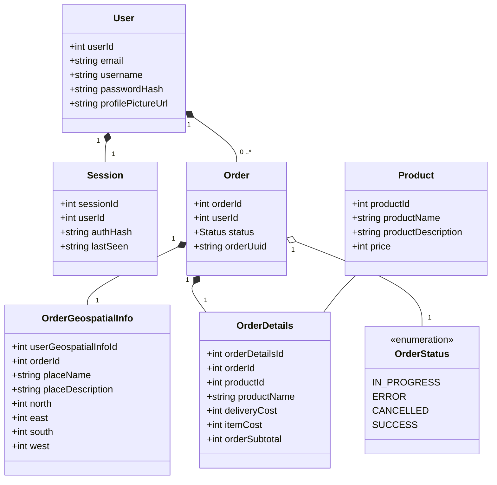

```mermaid
classDiagram
    class User {
        +int userId
        +string email
        +string username
        +string passwordHash
        +string profilePictureUrl
    }

    class Session {
        +int sessionId
        +int userId
        +string authHash
        +string lastSeen
    }

    class OrderGeospatialInfo {
        +int userGeospatialInfoId
        +int orderId
        +string placeName
        +string placeDescription
        +int north
        +int east
        +int south
        +int west
    }

    class Order {
        +int orderId
        +int userId
        +Status status
        +string orderUuid
    }

    class OrderDetails {
        +int orderDetailsId
        +int orderId
        +int productId
        +string productName
        +int deliveryCost
        +int itemCost
        +int orderSubtotal
    }

    class OrderStatus {
        <<enumeration>>
        IN_PROGRESS
        ERROR
        CANCELLED
        SUCCESS
    }

    class Product {
        +int productId
        +string productName
        +string productDescription
        +int price
    }

    User "1" *-- "0 ..*" Order
    Order "1" *-- "1" OrderGeospatialInfo
    User "1" *-- "1" Session
    Order "1" *-- "1" OrderDetails
    Order "1" o-- "1" OrderStatus

    Product -- OrderDetails

```
